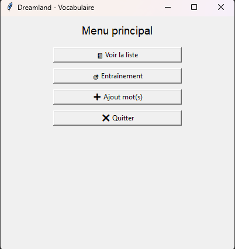
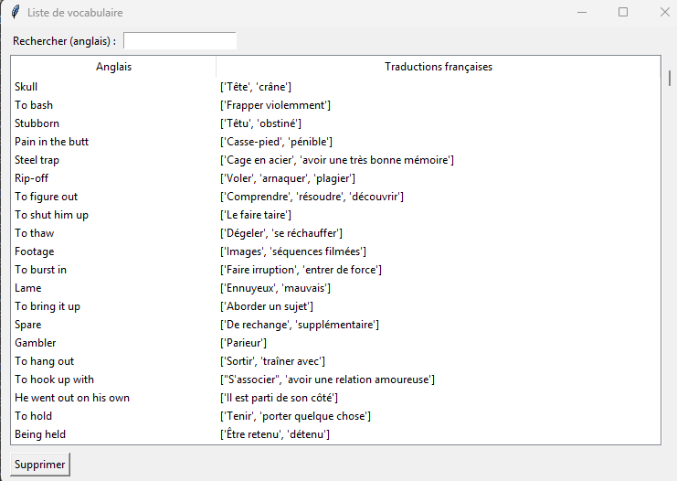
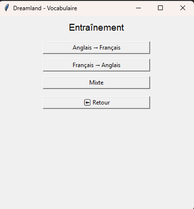
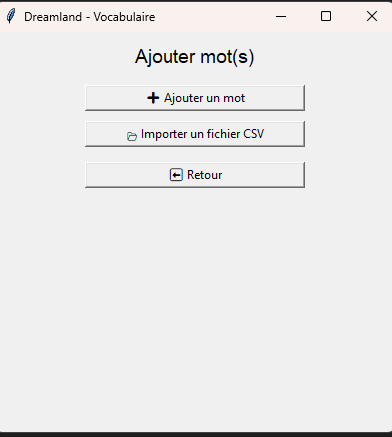

# Dreamland

*A personal Python project for vocabulary learning through adaptive practice.*

---

## Why "Dreamland"?

As a child, **dream** was one of the first English words I remember hearing repeatedly, but I was never curious enough at the time to look up its meaning. Somehow the word stayed with me.

Years later, when choosing my first online nickname, **dream** was the first word that came naturally to mind. It was at that moment that I finally learned what it meant and wanted to make it part of my nickname.

Being a big fan of Skrillex at the time, I added **mix** and created **Dreamix**.

Over time, the *mix* part disappeared as some friends simply started calling me **Dream**, and the name stayed.

It felt natural to give my first program a name that has followed me for years.

---

## How the project started

This project started from a personal problem.

While reading books in English (especially Harry Potter), I often stopped to translate words I did not know.

A few days later, I realized I kept stopping on the same words again and again — I was not retaining them.

I first wrote them down in notebooks, then in Excel spreadsheets, until I had collected more than 500 words.

At that point I thought:

**Why not build a tool to store them and train on them over time?**

That is how Dreamland was born.

Originally created for personal use and a small circle of friends learning English, it also became a way for me to learn programming by building something practical.

---

## Current Features

* Add vocabulary manually
* Import vocabulary from text files
* Duplicate checking
* Search words in the database
* Delete words
* Training mode (English → French)
* Training mode (French → English)
* Use a mixed mode combining both directions  
* Automatically save incorrect answers for later review  
* Launch dedicated practice sessions focused only on previously missed words

---

## Tech Stack

* Python
* JSON persistence (current version)
* MySQL migration planned

---

## Roadmap

Planned improvements:

* Migrate from JSON to MySQL
* Improve adaptive repetition based on repeated mistakes
* Add support for other languages
* Integrate a translation database
* Refactor code for modularity and reusability
* Redesign the graphical interface

---

## About the Interface

The interface is intentionally simple and functional.

The focus of the project has been learning, logic and features rather than graphical design.

For a personal tool designed for myself and a small circle of friends, usability mattered more than aesthetics.

## Code Status

The current version is functional but still being refactored.

The main focus of this project is learning by building: improving code structure, separating logic from the interface, and preparing a migration from JSON persistence to MySQL.

---

## Screenshots

### Main Menu

Launch vocabulary management, practice sessions and word import.

---

### Vocabulary Management

Browse, search and manage stored vocabulary entries.

---

### Practice Modes

Train in both directions or use a mixed mode.

---

### Vocabulary Import

Add words manually or import vocabulary from text/CSV files.

